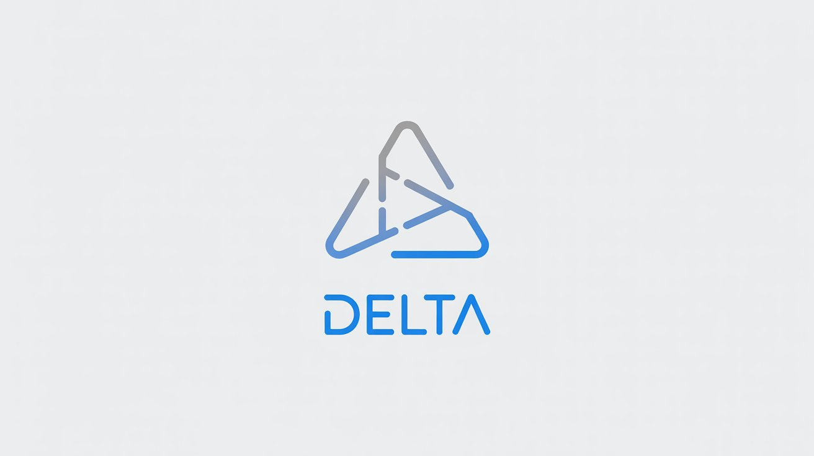

# Delta Programming Language



Delta is a modern, expressive programming language designed with natural language syntax that makes code more readable and intuitive. With its Python-like indentation system and English-like keywords, Delta aims to bridge the gap between human language and programming logic.

## Features

- **Natural Language Syntax**: Use phrases like "is greater than" instead of symbols
- **Indentation-based Structure**: Clean, readable code blocks without curly braces
- **Expressive Keywords**: Intuitive keywords like `let`, `be`, `when`, `then`, `otherwise`
- **Built-in Comparisons**: Natural comparison operators that read like English
- **String and Number Literals**: Full support for strings with escape sequences and floating-point numbers

## Example Code

```delta
let age be 25
let name be "Pranav"

when age is greater than or equal 18
    show "You are an adult"
otherwise
    show "You are a minor"

define greet with person_name
    show "Hello, " + person_name
end
```

## Getting Started

### Prerequisites

- Rust compiler (rustc)
- Cargo package manager

### Installation

1. Clone the repository:
```bash
git clone https://github.com/PranavVerma-droid/Delta.git
cd Delta
```

2. Build the project:
```bash
cargo build --release
```

3. Run a Delta program:
```bash
cargo run example.de
```

### Usage

Create a file with the `.de` extension and write your Delta code. Then run it using:

```bash
./target/release/delta your_file.de
```

## Language Grammar

The Delta language uses indentation to define code blocks, similar to Python. Each statement should be on its own line, and nested blocks are indicated by increased indentation.

### Basic Structure

```delta
statement
    indented_block
        nested_block
    back_to_previous_level
```

## License

This project is licensed under the MIT License - see the [LICENSE](LICENSE) file for details.

## Contact

For questions, suggestions, or contributions, please open an issue on GitHub.

---

*Delta - Making programming more human* 🚀